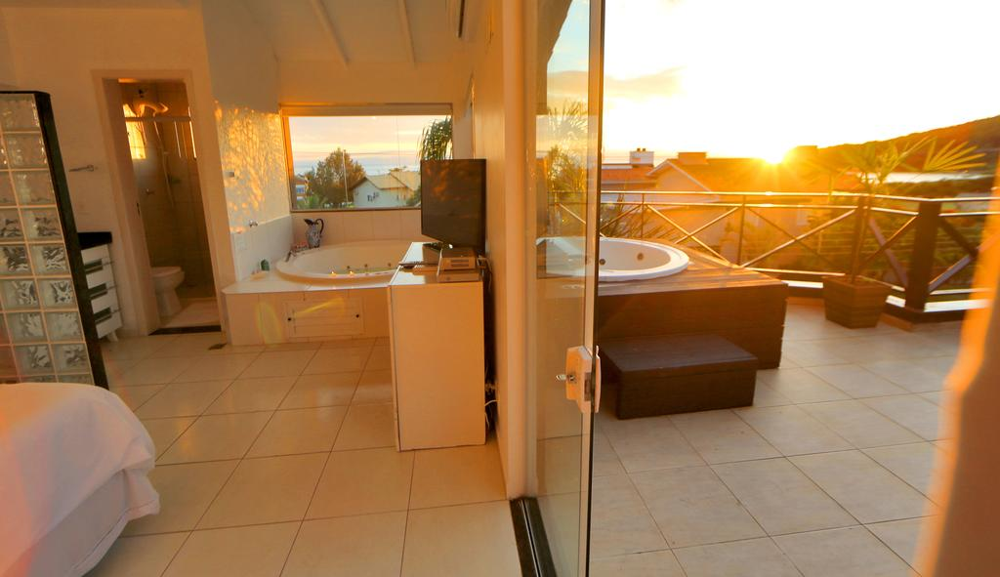
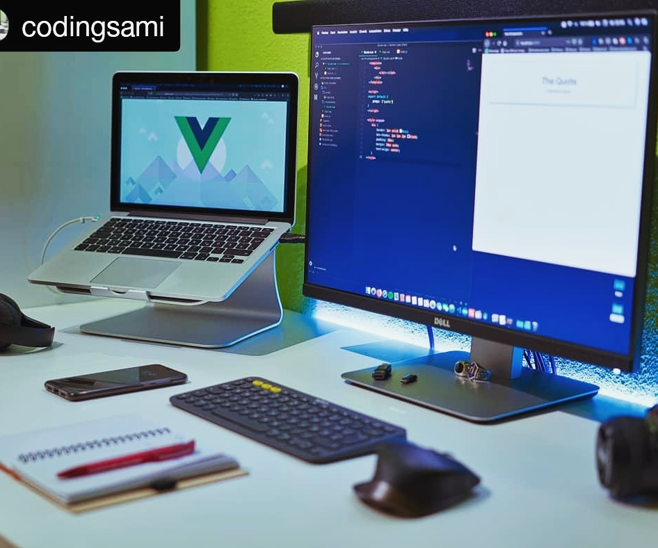

# Desafio "Primeiro Repositório no GIT"

Olá! me chamo Thiago, este arquivo Readme é uma apresentação do meu primeiro repositório, criado durante o Desafio sobre o próprio "GitHub".

# Algumas Tecnologias

    

# Página WEB Modelo 1.0

> Bela pousada no litoral catarinense

# Sugestões?

Deixe nos comentários!!